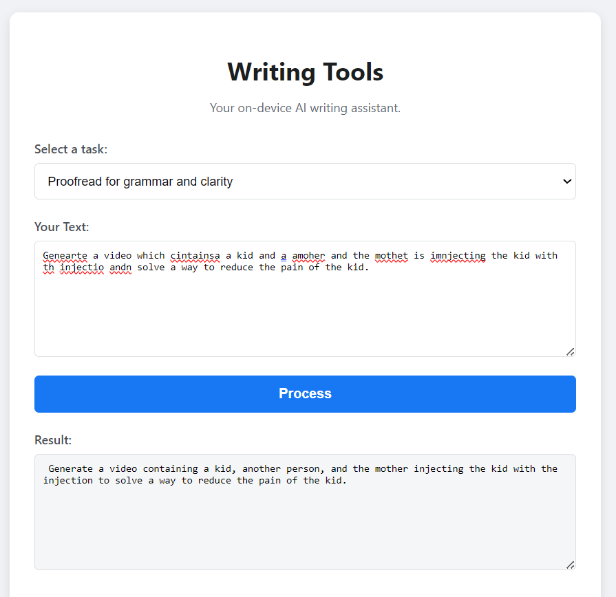

# EdgeWriter

An offline, on-device AI writing assistant for summarization, rewriting, proofreading, and paraphrasing. EdgeWriter uses a dual-model architecture with speculative decoding to provide fast, accurate text generation that runs entirely on your device - no internet required.

## Project Overview

EdgeWriter implements a **speculative decoding architecture** that adapts to whatever compute you have available:

- **Browser draft engine**: A MediaPipe LLM (`ui/nano_model_UI/weights.bin`) that always runs locally in the browser. It happily runs on CPU-only systems and opportunistically uses GPU when the browser exposes it.
- **Phi-3 verifier**: A llama.cpp server (`ui/phi_model_UI/server.py`) that loads a fine-tuned Phi-3 GGUF checkpoint. It automatically takes advantage of GPU layers for better accuracy.

This layered design keeps the entire workflow fully offline while still scaling up when extra hardware is present.

## Architecture

### Base Model

- **Foundation**: Microsoft Phi-3-mini-4k-instruct
- **Fine-tuning**: LoRA (Low-Rank Adaptation)
- **Quantization**: Q4 quantization for efficient deployment
- **Interface**: FastAPI UI in `ui/Integrated_UI`/`ui/phi_model_UI` plus the original Gradio notebook for experiments
- **Runtime**: llama.cpp backend that prefers GPU layers but transparently runs on CPU-only systems

### Draft Model

- **Type**: Small, highly optimized language model
- **Implementation**: JavaScript (MediaPipe LLM Inference)
- **Deployment**: Browser-based, runs via WebAssembly
- **Performance**: <5 sec generation, ~2GB RAM usage
- **Hardware**: Requires only a CPU; automatically enables WebGPU when the browser exposes it

### Speculative Decoding Pipeline

1. **CPU-only systems**: Draft model generates tokens directly for final output
2. **GPU-enabled systems**: Draft model generates candidate tokens → Base model verifies and refines → Enhanced accuracy output

## Training Details

### Datasets

All datasets were combined into a unified training corpus:

| Task          | Dataset       | Purpose                        |
| ------------- | ------------- | ------------------------------ |
| Summarization | CNN/DailyMail | Generate concise summaries     |
| Editing       | CoEDIT        | Text editing and rewriting     |
| Grammar       | JFLEG         | Grammar correction             |
| Paraphrasing  | PAWS          | Semantic paraphrase generation |

### Model Performance

The fine-tuned base model was evaluated using standard NLP metrics:

**ROUGE Scores:**

- ROUGE-1: 0.7886
- ROUGE-2: 0.6238
- ROUGE-L: 0.7478
- ROUGE-Lsum: 0.7482

**BLEU Score:**

- BLEU: 0.5905
- Brevity Penalty: 1.0
- Length Ratio: 1.015

## Quick Start

### Dual-Engine UI (Recommended)

1. **Navigate to the integrated UI:**

   ```bash
   cd EdgeWriter/ui/Integrated_UI
   ```
2. **Verify model assets**

   - Draft weights: `../nano_model_UI/weights.bin`
   - Phi-3 checkpoint: `../phi_model_UI/phi3-writing-Q8.gguf`
3. **Launch the server**

   - Windows: `start_dual_ui.bat`
   - Cross-platform: `python server.py`
4. **Open the app:** The script auto-opens `http://127.0.0.1:8000`. The MediaPipe draft model always runs, even on CPU-only systems, and the Phi-3 verifier joins in when its server process is active.

### Browser-only Draft UI

If you only need the lightweight MediaPipe model (or do not want to run the Phi-3 server yet):

```bash
cd EdgeWriter/ui/nano_model_UI
py -m http.server 8000   # or use start_server.bat on Windows
```

Then navigate to `http://127.0.0.1:8000`. This mode is entirely browser-based and needs no Python packages.

### Phi-3 Only UI

Run the fine-tuned Phi-3 interface directly when you want the highest-quality generations without the draft model shell:

```bash
cd EdgeWriter/ui/phi_model_UI
python server.py          # start_web_ui.bat is also available on Windows
```

The FastAPI server serves both the HTML UI and the inference API at `http://127.0.0.1:8000`, automatically using GPU layers when available and CPU otherwise.

### Example Output

Here's an example of the base model performing a proofreading task:



## 💻 Installation & Environment Setup

### Prerequisites

- Python 3.11+
- CUDA 12+ (optional, for GPU acceleration)
- 8GB+ RAM (16GB recommended for base model training)

### Setup Instructions

1. **Clone the repository:**

   ```bash
   git clone https://github.com/Geek-yash666/EdgeWriter
   cd EdgeWriter
   ```
2. **Option A: Using Conda (Recommended)**

   ```bash
   conda env create -f environment.yml
   conda activate edgewriter
   ```
3. **Option B: Using pip**

   ```bash
   python -m venv .venv
   # macOS/Linux
   source .venv/bin/activate
   # Windows
   .venv\Scripts\activate

   pip install --upgrade pip
   pip install -r requirements.txt
   ```

## 📁 Project Structure

```
EdgeWriter/
├── data/                         # Dataset preparation notebooks
│   └── data.ipynb
├── docs/                         # Architecture notes & screenshots
├── notebooks/                    # Research + export notebooks
│   ├── Phi3_finetuned_base_model.ipynb
│   ├── Transformers_to_onnx.ipynb
│   └── Transformers_to_web_llm_mlc.ipynb
├── results/                      # Training/eval artifacts
├── ui/                           # All deployment-ready user interfaces
│   ├── Integrated_UI/            # Dual-engine UI + FastAPI server
│   │   ├── index.html / index.js
│   │   ├── server.py
│   │   └── start_dual_ui.bat
│   ├── nano_model_UI/            # Browser-only MediaPipe UI (weights.bin)
│   ├── phi_model_UI/             # Standalone Phi-3 FastAPI UI (phi3-writing-Q8.gguf)
│   ├── OG/                       # Legacy UI experiments
│   ├── Test/                     # Scratch UI variations
│   └── other/                    # Utility launchers & prototypes
├── environment.yml               # Conda environment definition
├── requirements.txt              # Pip dependencies
└── README.md
```

## Model Development Workflow

1. **Data Processing**: Combine and preprocess datasets from multiple sources
2. **Base Model Fine-tuning**: Apply LoRA to Phi-3-mini-4k-instruct
3. **Model Merging**: Merge LoRA adapters with base weights
4. **Quantization**: Apply Q4 quantization for deployment
5. **Evaluation**: Test with ROUGE and BLEU metrics
6. **Draft Model Optimization**: Create lightweight model for browser deployment
7. **Integration**: Implement speculative decoding pipeline

## 🛠️ Technologies Used

- **Training**: PyTorch, Hugging Face Transformers, PEFT (LoRA)
- **Inference**: MediaPipe LLM Inference (JavaScript), Gradio
- **Quantization**: bitsandbytes, GGUF format
- **Datasets**: Hugging Face Datasets library
- **UI**: HTML/CSS/JavaScript, Gradio

## 👤 Author & Contact

- **Author**: Roop Yaswanth Nagabhairava
- **Email**: nagabhairava.r@ufl.edu
- **Institution**: University of Florida

## 📄 License

This project is licensed under the terms specified in the LICENSE file.
