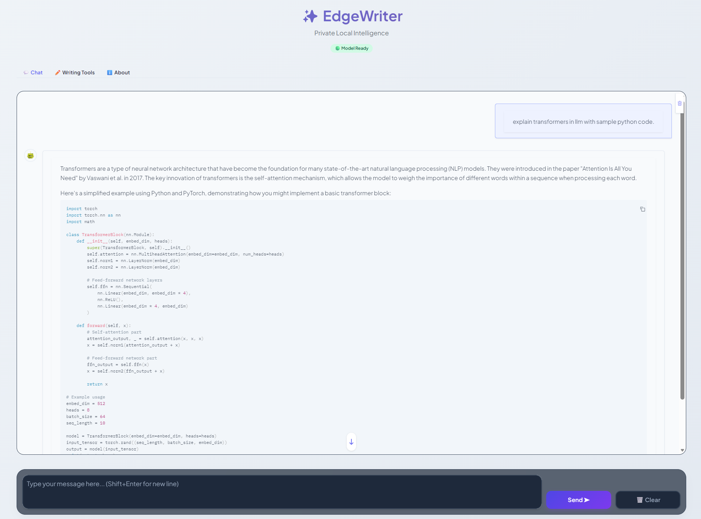

# ⚡ EdgeWriter AI

**An offline, privacy-first AI writing assistant powered by a dual-model architecture.**

EdgeWriter is a local AI application designed for summarization, rewriting, proofreading, and paraphrasing. It uses a unique **speculative decoding architecture** that combines a lightweight browser-based model with a powerful server-side model to provide fast, accurate text generation that runs entirely on your device.

---

## 🚀 Key Features

### 🔒 100% Local & Private

* **Offline Capable**: No internet connection required after initial setup.
* **Zero Data Leakage**: No API keys, no cloud servers. Your text stays on your machine.

### 🧠 Dual-Engine Intelligence

1. **Draft Engine (Gemini Nano-style)**:
   * **Technology**: WebGPU (runs directly in Chrome/Edge).
   * **Best For**: Instant rewriting, tone adjustments, and quick edits.
   * **Speed**: Extremely fast, low latency.
2. **Foundation Engine (Phi-3 Mini)**:
   * **Technology**: Python Server + `llama.cpp` (Quantized).
   * **Best For**: Complex reasoning, summarization, and creative generation.
   * **Quality**: Higher fidelity output with context awareness.

### 💬 Chat Mode

Interact with your AI naturally through a dedicated conversational interface.

* **Context Aware**: The chat remembers previous turns in the conversation, allowing for follow-up questions and iterative refinements.
* **Engine Switching**: Seamlessly switch between the **Nano** model for quick, snappy answers and the **Phi-3** model for deeper, more thoughtful responses.
* **System Prompts**: Customizable personas allow you to define how the chat assistant behaves (e.g., "You are a helpful coding tutor").

### ✍️ Advanced Writing Tools

* **Rewrite**: Instantly change text tone (Professional, Friendly, Academic, Concise).
* **Summarize**: Condense long articles or notes into bullet points.
* **Proofread**: Fix grammar and spelling without changing the meaning.
* **Paraphrase**: Rephrase sentences to improve flow and clarity.

### 📊 Real-Time Telemetry

* **Performance Metrics**: View inference speed (tokens/sec) and latency in real-time.
* **Hardware Stats**: Monitor GPU VRAM usage and CPU load directly in the UI.

---

## 📁 Project Structure

```
EdgeWriter/
├── data/                         # Dataset preparation notebooks
├── notebooks/                    # Research, fine-tuning, and export notebooks
├── results/                      # Training artifacts and evaluation graphs
├── ui/                           # User Interfaces
│   ├── Integrated_UI/            # Main Dual-Engine Application
│   │   ├── server.py             # FastAPI Orchestrator
│   │   └── index.html            # Unified Frontend
│   ├── nano_model_UI/            # Browser-only implementation
│   │   ├── weights.bin           # MediaPipe Model Weights
│   │   └── system_prompt.txt     # Customizable System Prompt
│   ├── phi_model_UI/             # Server-side implementation
│   │   ├── phi3-writing-Q8.gguf  # Quantized Model Checkpoint
│   │   └── gradio_app.py         # Gradio Experiment Interface
│   └── OG/                       # Legacy experiments
├── environment.yml               # Conda environment definition
├── requirements.txt              # Pip dependencies
└── README.md                     # This file
```

---

## 📸 Screenshots

### Nano Model UI


### Chat Interface



---

## 🛠️ Installation & Prerequisites

### Prerequisites

1. **Python 3.10+**: Required for the backend server.
2. **Web Browser**: Google Chrome or Microsoft Edge (for WebGPU support).
3. **Hardware**:
   * **Minimum**: Modern CPU + 8GB RAM.
   * **Recommended**: NVIDIA GPU (RTX 3060 or higher) for optimal Phi-3 performance.

### Setup

1. **Clone the Repository**:

   ```bash
   git clone https://github.com/yourusername/EdgeWriter.git
   cd EdgeWriter
   ```
2. **Install Dependencies**:

   ```bash
   pip install -r ui/phi_model_UI/requirements.txt
   ```

   > **⚡ NVIDIA GPU Users**: To enable hardware acceleration for the Phi-3 model, install the CUDA-enabled version of `llama-cpp-python`:
   >
   > ```bash
   > pip install --upgrade --force-reinstall --no-cache-dir https://github.com/abetlen/llama-cpp-python/releases/download/v0.3.4-cu124/llama_cpp_python-0.3.4-cp310-cp310-win_amd64.whl
   > ```
   >
   > *(Note: Ensure the URL matches your Python and CUDA version).*
   >
3. **Download Models**:

   * Place `weights.bin` in `ui/nano_model_UI/`.
   * Place `phi3-writing-Q8.gguf` in `ui/phi_model_UI/`.

---

## ▶️ Usage

### 1. Integrated UI (Recommended)

Runs both engines in a single interface.

* **Windows**: Double-click `ui/Integrated_UI/start_dual_ui.bat`.
* **Manual**:

  ```bash
  cd ui/Integrated_UI
  python server.py
  ```

  *This launches a temporary browser profile optimized for WebGPU.*

### 2. Nano-Only UI (WebGPU)

Lightweight mode using only the browser-based model.

* **Windows**: Double-click `ui/nano_model_UI/start_server.bat`.

### 3. Phi-3 Only UI (Gradio/Web)

Focus on the larger model with a standard interface.

* **Windows**: Double-click `ui/phi_model_UI/start_web_ui.bat`.

---

## 🔧 Configuration

* **System Prompt**: Modify `ui/nano_model_UI/system_prompt.txt` to change the default persona of the AI.
* **Model Weights**: Ensure the correct `.bin` and `.gguf` files are in their respective directories.

---

## Technologies Used

* **Training**: PyTorch, Hugging Face Transformers, PEFT (LoRA)
* **Inference**: MediaPipe LLM Inference (JS), llama.cpp (Python/C++)
* **Backend**: FastAPI, Uvicorn
* **Frontend**: HTML5, TailwindCSS, JavaScript
* **Quantization**: bitsandbytes, GGUF

## 👤 Author

**Roop Yaswanth Nagabhairava**

* **Institution**: University of Florida
* **Contact**: nagabhairava.r@ufl.edu

## 📄 License

This project is licensed under the terms specified in the [LICENSE](LICENSE) file.
