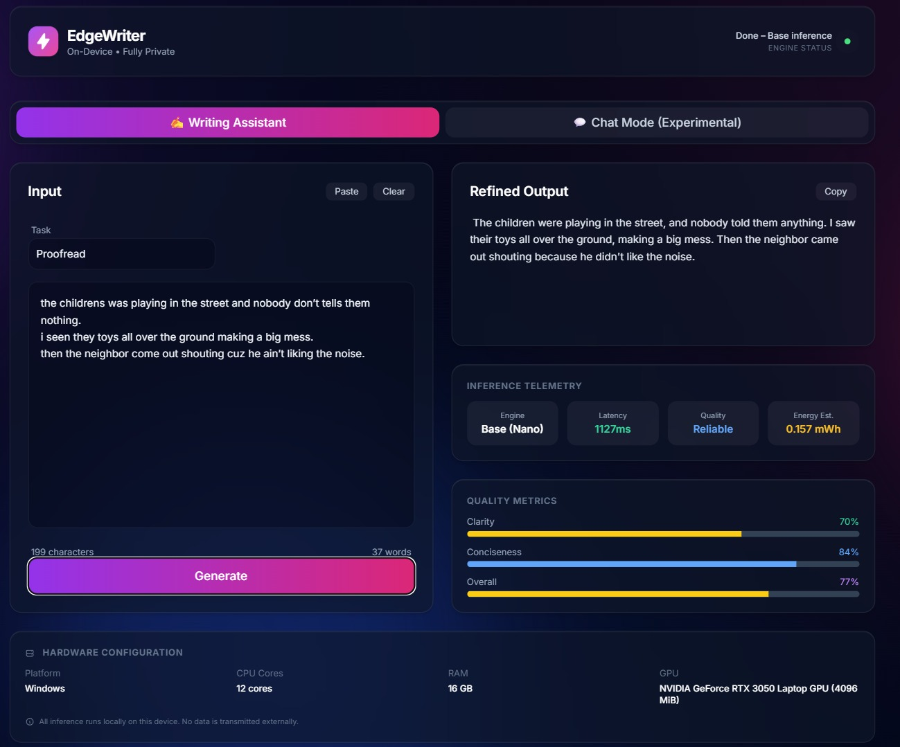
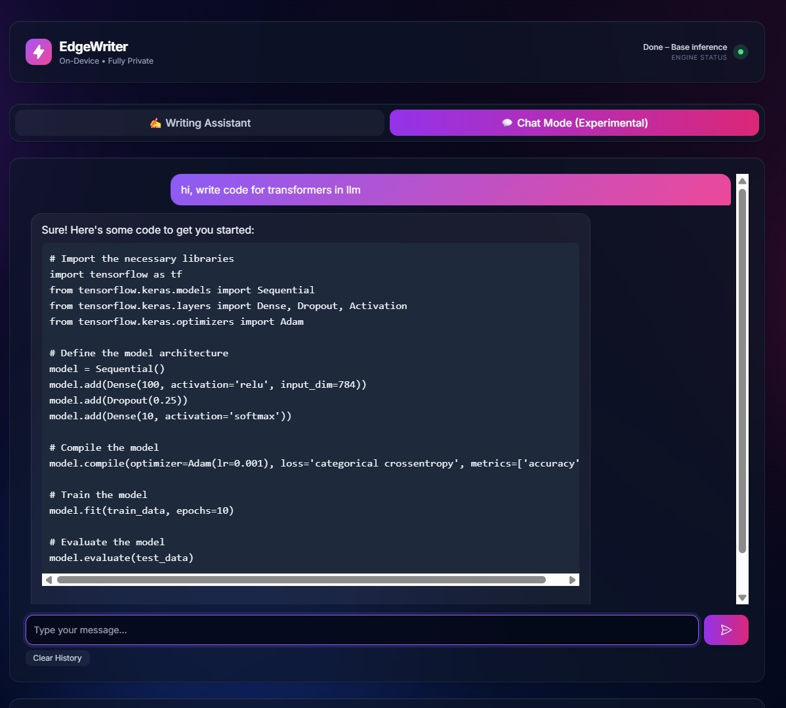

# EdgeWriter AI - Nano Model UI

EdgeWriter AI is a powerful, privacy-focused writing assistant and chat interface that runs the Gemini Nano model entirely locally in your browser using WebGPU.

## 🚀 Features

* **Local Inference**: Runs 100% on your device using WebGPU. No data leaves your computer.
* **Hardware Acceleration**: Automatically detects and utilizes your high-performance GPU (NVIDIA) for faster inference.
* **Dual Modes**:
  * **Writing Mode**: specialized for text generation, rewriting, and refinement. Includes tone selection and quality metrics (clarity, conciseness).
  * **Chat Mode**: A conversational interface for general interaction (automatically disabled on low-resource hardware).
* **Real-time Metrics**: Monitor inference speed, token generation rate, and estimated energy usage.
* **Adaptive Performance**: Automatically adjusts settings based on your hardware capabilities (e.g., enabling "Low Resource Mode" for integrated graphics).

## Screenshots

### Writing Mode


*The writing interface with real-time metrics and tone controls.*

### Chat Mode


*The conversational chat interface.*

## Prerequisites

* **Python 3.x**: Required to run the local server.
* **Web Browser**: A modern browser with WebGPU support (Google Chrome or Microsoft Edge recommended).
* **Hardware**: A dedicated GPU (NVIDIA RTX series recommended) is preferred for optimal performance, but the application can run on capable integrated graphics in low-resource mode.

## 🛠️ Installation & Usage

1. **Navigate to the directory**:

   ```bash
   cd ui/nano_model_UI
   ```
2. **Start the Application**:

   * **Windows**: Double-click `start_server.bat `
     OR
   * **Command Line**: Run `python server.py`

   The script will:

   * Start a local HTTP server on port 8000.
   * Launch a temporary browser instance with specific flags to enable WebGPU and force high-performance GPU usage.
   * Clean up temporary files when you close the application.

## 📂 File Structure

* **`index.html`**: The main user interface structure.
* **`index.js`**: Core application logic, handling UI interactions and WebGPU model inference via MediaPipe.
* **`server.py`**: A Python server that hosts the application and manages the browser process to ensure hardware acceleration is correctly enabled.
* **`start_server.bat`**: A convenience script to launch the server on Windows.
* **`system_prompt.txt`**: Defines the base persona and instructions for the AI model.
* **`libs/`**: Contains necessary libraries (TailwindCSS, MediaPipe GenAI tasks, etc.).
* **`weights.bin`**: (Required) The model weights file. *Note: Ensure this file is present in the directory or the application will attempt to download/locate it.*

## 🔧 Configuration

* **System Prompt**: You can modify `system_prompt.txt` to change the default behavior or persona of the AI.
